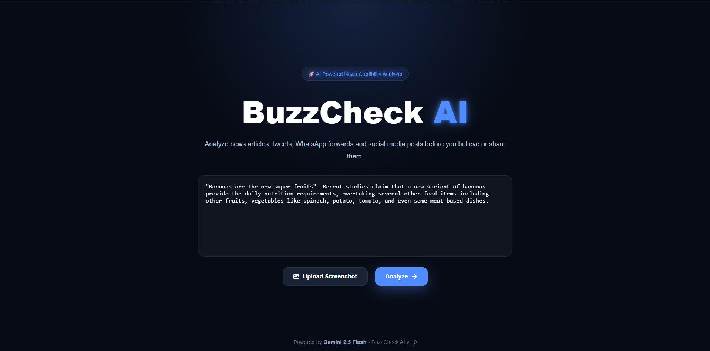

# 📰 BuzzCheck AI

An AI-powered News Credibility Analyzer that evaluates articles, tweets, and social media posts for credibility, sensationalism, and manipulation using Large Language Models.

## ✨ Features

- 🤖 AI-powered credibility analysis
- 📊 Trust Score Dashboard
- 📝 Automatic article summary
- 📌 Claim extraction
- ⚠️ Manipulation detection
- 🎭 Sensationalism analysis
- 😊 Emotion analysis
- 📄 AI-generated verdict
- ⚡ Modern React + FastAPI architecture

---

## 🛠 Tech Stack

### Frontend
- React
- Vite
- CSS
- React Icons

### Backend
- FastAPI
- Python
- Google Gemini 2.5 Flash
- Pydantic

---

## 📂 Project Structure

```
news-analyzer/
│
├── frontend/
│   ├── src/
│   └── ...
│
├── backend/
│   ├── app/
│   ├── main.py
│   └── ...
│
└── README.md
```

---

## 🚀 Getting Started

### Backend

```bash
cd backend

python -m venv venv

venv\Scripts\activate

pip install -r requirements.txt

uvicorn main:app --reload
```

### Frontend

```bash
cd frontend

npm install

npm run dev
```

---

## 🔑 Environment Variables

Create a `.env` file inside the backend folder.

```env
GEMINI_API_KEY=your_api_key_here
```

---

## 📸 Preview

### Home Screen



---

### AI Analysis Loading


---

### Fake News Detection


---

### Real News Analysis


---

## 🔮 Future Improvements

- Live web verification
- Entity extraction with spaCy
- Search API integration
- OCR support
- Evidence quality scoring
- Source credibility database
- Export analysis reports

---

## 👨‍💻 Author

**Sameer Shahi**